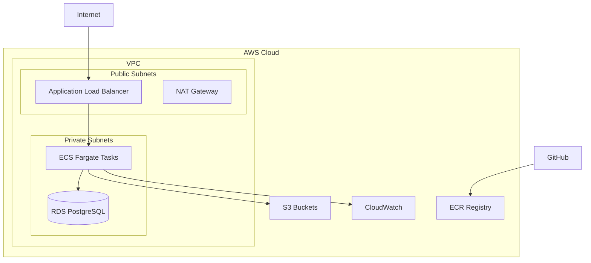

# ADR 004: Cloud Provider Selection

**Date**: 2024-01-01  
**Status**: Accepted  
**Deciders**: DevOps Team, ML Engineering Team, Management  

## Context

We need to select a cloud provider for hosting our ML CI/CD pipeline infrastructure. The infrastructure must support:

- Container orchestration for model serving
- Managed database services for MLflow backend
- Object storage for model artifacts and data
- Compute resources for model training
- Monitoring and logging capabilities
- Cost-effective scaling for variable workloads

Key requirements:
- Reliable, enterprise-grade services
- Strong ML/AI service ecosystem
- Competitive pricing structure
- Good integration with our chosen tools (Docker, Terraform, MLflow)
- Geographic coverage for low latency
- Compliance and security features

Options considered:
- **Amazon Web Services (AWS)**
- **Google Cloud Platform (GCP)**
- **Microsoft Azure**
- **Multi-cloud approach**

## Decision

We will use **Amazon Web Services (AWS)** as our primary cloud provider.

### Rationale

1. **Mature ML Services**: Comprehensive ML platform with SageMaker, extensive pre-trained models
2. **Container Orchestration**: Excellent ECS/Fargate support with minimal management overhead
3. **Storage Options**: S3 provides reliable, cost-effective artifact storage with MLflow integration
4. **Database Services**: RDS PostgreSQL offers managed database with automated backups
5. **Ecosystem Integration**: Strong Terraform provider and extensive community resources
6. **Cost Management**: Detailed billing, spot instances, and reserved capacity options
7. **Security & Compliance**: Industry-leading security features and compliance certifications

### Architecture Components

**Core Services:**
- **ECS Fargate**: Serverless container orchestration for model serving
- **RDS PostgreSQL**: Managed database for MLflow backend store
- **S3**: Object storage for MLflow artifacts and data storage
- **ECR**: Private Docker registry for container images
- **Application Load Balancer**: Traffic distribution and SSL termination

**Supporting Services:**
- **VPC**: Isolated network environment with public/private subnets
- **IAM**: Fine-grained access control and service authentication
- **CloudWatch**: Monitoring, logging, and alerting
- **Systems Manager**: Parameter store for configuration management
- **Secrets Manager**: Secure credential storage

## Implementation Strategy

### Infrastructure as Code
```hcl
# Terraform configuration structure
terraform/
├── modules/
│   ├── vpc/           # Network infrastructure
│   ├── ecs/           # Container orchestration
│   ├── rds/           # Database services
│   └── s3/            # Storage buckets
├── environments/
│   ├── dev/           # Development environment
│   ├── staging/       # Staging environment
│   └── prod/          # Production environment
└── main.tf            # Main configuration
```

### Service Architecture


### Cost Optimization Strategy

**Right-sizing Resources:**
- Start with t3.micro for RDS (can scale up)
- Use Fargate Spot for non-critical workloads
- Implement auto-scaling based on demand

**Storage Optimization:**
- S3 Intelligent Tiering for MLflow artifacts
- Lifecycle policies for old artifacts
- Compress model artifacts where possible

**Compute Optimization:**
- Reserved instances for predictable workloads
- Spot instances for training workloads
- Scheduled scaling for known usage patterns

## Consequences

### Positive
- ✅ **Reliability**: 99.99% SLA with multi-AZ deployments
- ✅ **Scalability**: Auto-scaling capabilities for variable workloads
- ✅ **Security**: Comprehensive security tools and compliance frameworks
- ✅ **Integration**: Excellent Terraform and MLflow integration
- ✅ **Cost Control**: Detailed billing and cost optimization tools
- ✅ **Support**: 24/7 support options and extensive documentation
- ✅ **Innovation**: Rapid release of new ML/AI services

### Negative
- ❌ **Vendor Lock-in**: Dependency on AWS-specific services
- ❌ **Complexity**: Learning curve for AWS service ecosystem
- ❌ **Cost Visibility**: Complex pricing models can be confusing
- ❌ **Regional Limitations**: Some services not available in all regions

### Mitigation Strategies

**Vendor Lock-in:**
- Use standard protocols and APIs where possible
- Document migration procedures for critical services
- Implement infrastructure as code for portability
- Avoid proprietary AWS features for core functionality

**Cost Management:**
- Implement cost monitoring and alerting
- Regular cost optimization reviews
- Use AWS Cost Explorer and trusted advisor
- Set up billing alerts for unexpected costs

**Multi-Region Strategy:**
- Deploy in primary region (us-west-2) initially
- Plan for multi-region expansion for DR
- Use CloudFormation StackSets for consistent deployments

## Service Selection Rationale

### ECS Fargate vs. EKS
**Chosen: ECS Fargate**
- Lower operational overhead
- Serverless container execution
- Better integration with other AWS services
- Simpler for initial deployment

### RDS vs. Self-managed Database
**Chosen: RDS PostgreSQL**
- Automated backups and maintenance
- Multi-AZ deployment for high availability
- Performance insights and monitoring
- Reduced operational burden

### S3 vs. EFS vs. EBS
**Chosen: S3 for artifacts**
- Native MLflow integration
- Virtually unlimited scalability
- Cost-effective for infrequent access
- Built-in versioning and lifecycle management

## Security Implementation

### Network Security
- VPC with private subnets for sensitive resources
- Security groups with minimal required access
- VPC Flow Logs for network monitoring
- AWS WAF for application-level protection

### Access Control
- IAM roles with least privilege principle
- Cross-account roles for CI/CD access
- MFA requirements for administrative access
- Regular access reviews and rotation

### Data Protection
- Encryption at rest for all storage services
- Encryption in transit with TLS/SSL
- AWS KMS for encryption key management
- Regular security assessments

## Monitoring and Observability

### CloudWatch Integration
- Custom metrics for model performance
- Log aggregation from all services
- Automated alerting for critical issues
- Dashboards for operational visibility

### Cost Monitoring
- Daily cost reports
- Budget alerts for overspending
- Regular cost optimization reviews
- Resource tagging for cost allocation

## Related Decisions
- [ADR 001: Choice of Machine Learning Framework](001-framework-choice.md)
- [ADR 002: Containerization Strategy](002-containerization-strategy.md)
- [ADR 003: CI/CD Tooling](003-cicd-tooling.md)

## Future Considerations

- Evaluate multi-cloud strategy for redundancy
- Consider AWS SageMaker for advanced ML workflows
- Explore serverless options (Lambda) for lightweight processing
- Investigate AWS Batch for large-scale training workloads

## References
- [AWS Well-Architected Framework](https://aws.amazon.com/architecture/well-architected/)
- [AWS ML Best Practices](https://docs.aws.amazon.com/wellarchitected/latest/machine-learning-lens/)
- [Terraform AWS Provider](https://registry.terraform.io/providers/hashicorp/aws/latest/docs)
