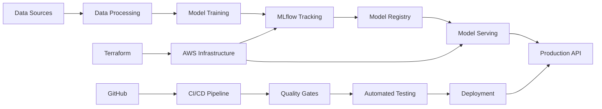

# ML CI/CD Pipeline Documentation

Welcome to the comprehensive documentation for the ML CI/CD Pipeline project! This documentation will guide you through setting up, developing, and deploying a complete MLOps pipeline using modern tools and best practices.

## 🎯 Project Overview

This project demonstrates a complete end-to-end machine learning pipeline that includes:

- **Data Management**: Version control with DVC
- **Model Development**: PyTorch with Hugging Face Transformers
- **Experiment Tracking**: MLflow for experiments and model registry
- **Code Quality**: Automated formatting, linting, and testing
- **CI/CD**: GitHub Actions for continuous integration and deployment
- **Infrastructure**: Terraform for AWS cloud deployment
- **Model Serving**: FastAPI-based REST API with Docker containers

## 🏗️ Architecture at a Glance

## 🚀 Quick Navigation

### For Developers
- [Quick Start Guide](getting-started/quickstart.md) - Get up and running in 5 minutes
- [Local Development](getting-started/local-development.md) - Set up your development environment
- [Development Workflow](development/workflow.md) - Learn the development process

### For Data Scientists
- [MLflow Setup](mlflow/setup.md) - Configure experiment tracking
- [Model Training](mlflow/experiments.md) - Track and compare experiments
- [Model Registry](mlflow/registry.md) - Manage model versions

### For DevOps Engineers
- [Infrastructure](aws/infrastructure.md) - Deploy to AWS with Terraform
- [CI/CD Pipeline](cicd/overview.md) - Understand the automation
- [Monitoring](aws/monitoring.md) - Set up observability

## 📋 Key Features

### 🧠 Machine Learning
- **Framework**: PyTorch with Hugging Face Transformers
- **Data**: Automated data preprocessing and validation
- **Experiments**: Comprehensive tracking with MLflow
- **Models**: Versioned model registry with lifecycle management

### 🛠️ Development
- **Code Quality**: Black, isort, Ruff, mypy, bandit
- **Testing**: Unit, integration, and end-to-end tests with pytest
- **Pre-commit**: Automated quality checks on every commit
- **Documentation**: Comprehensive docs with MkDocs

### 🚀 Deployment
- **Containerization**: Docker for all components
- **Orchestration**: Docker Compose for local, ECS for production
- **Infrastructure**: Terraform for reproducible AWS deployments
- **API**: FastAPI-based model serving with automatic documentation

### 🔄 CI/CD
- **Automation**: GitHub Actions for all workflows
- **Quality Gates**: Multiple quality checks before deployment
- **Security**: Automated security scanning and compliance checks
- **Monitoring**: Built-in logging and metrics collection

## 🎓 Learning Path

### Beginner
1. [Installation Guide](getting-started/installation.md)
2. [Quick Start](getting-started/quickstart.md)
3. [Local Development](getting-started/local-development.md)
4. [Basic Workflow](development/workflow.md)

### Intermediate
1. [Architecture Overview](architecture/overview.md)
2. [MLflow Integration](mlflow/setup.md)
3. [Testing Strategy](development/testing.md)
4. [CI/CD Pipeline](cicd/overview.md)

### Advanced
1. [AWS Deployment](aws/infrastructure.md)
2. [Performance Optimization](troubleshooting/performance.md)
3. [Security Considerations](architecture/security.md)
4. [Production Monitoring](aws/monitoring.md)

## 🆘 Need Help?

- **Issues**: Check our [Troubleshooting Guide](troubleshooting/common-issues.md)
- **FAQ**: Browse [Frequently Asked Questions](troubleshooting/faq.md)
- **Support**: Create an issue on [GitHub](https://github.com/your-username/ml_ci_cd/issues)

## 🤝 Contributing

We welcome contributions! Please see our [Development Guide](development/setup.md) for information on how to contribute to this project.

## 📄 License

This project is licensed under the MIT License. See the [LICENSE](https://github.com/your-username/ml_ci_cd/blob/main/LICENSE) file for details.

---

**Ready to get started?** Jump to the [Quick Start Guide](getting-started/quickstart.md) to begin your MLOps journey!
